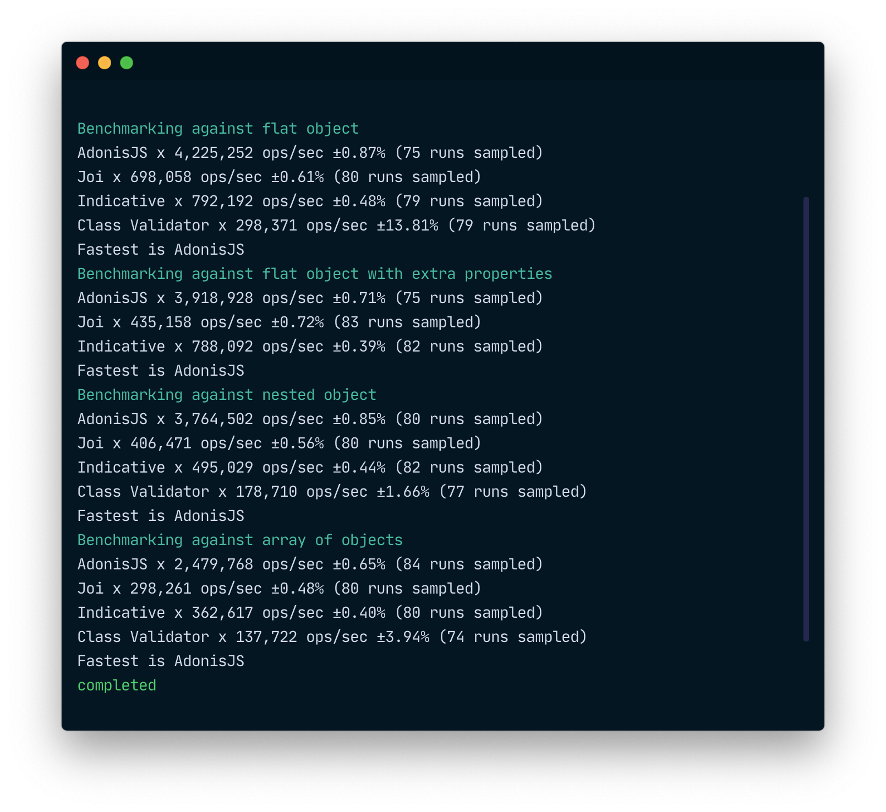

# AdonisJS Validator
> Schema validator for AdonisJS

[![circleci-image]][circleci-url] [![typescript-image]][typescript-url] [![npm-image]][npm-url] [![license-image]][license-url]

I have been maintaining [indicative](https://indicative.adonisjs.com/) (used by this repo) for many years and learned a lot about the validation engines. This time I want to approach data validation from scratch and address lot of design issues that Indicative has and also squeeze out maximum performance this time.

<!-- START doctoc generated TOC please keep comment here to allow auto update -->
<!-- DON'T EDIT THIS SECTION, INSTEAD RE-RUN doctoc TO UPDATE -->
## Table of contents

- [Benchmarks](#benchmarks)
- [Goals](#goals)
- [Usage](#usage)

<!-- END doctoc generated TOC please keep comment here to allow auto update -->

## Benchmarks
Let's compare the validator performance in comparison to some of the famous libraries in the Node.js Ecosystem.

- [Joi](https://hapi.dev/family/joi/) is one of the most famous and widely used schema validator for Node.js. 
- [Class Validator](https://github.com/typestack/class-validator) is a popular library in the Typescript world, since it allows you to keep your static types in sync with the runtime validations.
- [Indicative](https://indicative.adonisjs.com/) My own work.

<pre><code>Benchmarking against flat object
AdonisJS x 4,827,208 ops/sec ±1.50% (66 runs sampled)
Joi x 610,986 ops/sec ±0.66% (82 runs sampled)
Indicative x 833,243 ops/sec ±0.42% (84 runs sampled)
Class Validator x 351,342 ops/sec ±0.53% (83 runs sampled)
Fastest is AdonisJS

Benchmarking against flat object with extra properties
AdonisJS x 4,810,872 ops/sec ±0.94% (64 runs sampled)
Joi x 446,868 ops/sec ±0.52% (82 runs sampled)
Indicative x 840,674 ops/sec ±0.51% (79 runs sampled)
Fastest is AdonisJS

Benchmarking against nested object
AdonisJS x 4,538,678 ops/sec ±0.57% (81 runs sampled)
Joi x 393,278 ops/sec ±0.56% (81 runs sampled)
Indicative x 524,408 ops/sec ±0.46% (83 runs sampled)
Class Validator x 215,683 ops/sec ±0.40% (83 runs sampled)
Fastest is AdonisJS

Benchmarking against array of objects
AdonisJS x 1,348,083 ops/sec ±0.59% (82 runs sampled)
Joi x 269,459 ops/sec ±0.69% (79 runs sampled)
Indicative x 389,542 ops/sec ±0.43% (83 runs sampled)
Class Validator x 180,988 ops/sec ±0.88% (80 runs sampled)
Fastest is AdonisJS</code></pre>

## Goals
**No code is the fastest code**. In other words, making something fast is not a big deal, if you cut out all the features and compromise usability on every front.

I didn't started with making one of the fastest validation engines for Node.js. The goals were completely different and performance was just one of them.

- [x] **Treat Typescript as a first class citizen**. Runtime validations and static types should always be in sync. In other words, no need to write seperate interfaces for maintaining types.
- [x] **Performance is important**. Validating user input is a very common task every Web server has to perform and hence squeezing out more performance on this front is critical.
- [x] **Do not mutate original data**: The validator returns a new copy of data, holding only the validated properties. In the process, the original data object is never mutated.
- [x] **Don't be stringent about errors format**: Many validation libraries returns errors in a single hardcoded structure. If you need them in a different shape, then running a loop on the errors is the only option. 
  With AdonisJS, it is as simple as creating an Error Formatter with couple of methods on it.

## Usage
Docs will be added soon to the AdonisJS official website

[circleci-image]: https://img.shields.io/circleci/project/github/adonisjs/adonis-validation-provider/master.svg?style=for-the-badge&logo=circleci
[circleci-url]: https://circleci.com/gh/adonisjs/adonis-validation-provider "circleci"

[typescript-image]: https://img.shields.io/badge/Typescript-294E80.svg?style=for-the-badge&logo=typescript
[typescript-url]:  "typescript"

[npm-image]: https://img.shields.io/npm/v/@adonisjs/validator.svg?style=for-the-badge&logo=npm
[npm-url]: https://npmjs.org/package/@adonisjs/validator "npm"

[license-image]: https://img.shields.io/npm/l/@adonisjs/validator?color=blueviolet&style=for-the-badge
[license-url]: LICENSE.md "license"
